# 焊接调试指北
<!-- vscode-markdown-toc -->
* [1. 背景](#bg)
* [2. 准备工作](#prepare)
    * [2.1 物料&装备](#materials)
    * [2.2 焊接调试顺序](#rank)
* [3. 焊接与调试](#paste)
    * [3.1 CH340 & USB  **锡膏焊接**](#ch340)
    * [3.2 电源管理芯片 **锡丝焊接**](#chg)
    * [3.3 稳压芯片 & 开关控制](#lpo)
    * [3.4 MCU拖焊 **拖焊**](#mcu)
    * [3.5 编码器 & 蜂鸣器](#encoder)
    * [3.6 SD卡槽](#sd)
    * [3.7 屏幕](#lcd)
    * [3.8 GPS](#gps)
* [4. 整体测试](#debug)

<!-- /vscode-markdown-toc -->

## <a name="bg"> 1. 背景

骑行爱好者，略懂电子学的东西，加了一个DIY的群，发现很多老哥没有焊接的经验，焊接完之后也没有思路去debug，故写下这篇指北，希望能给新人提供一些帮助，也希望大家能够通过这个项目感受到电子制作的乐趣。

## <a name="prepare"> 2. 准备工作

### <a name="materials"> 2.1 物料&装备

首先大家需要按照[BOM表](./X-Track.pdf)去采购相应的物料，对于一些便宜的元件（MOSFET 阻容 二极管等）可以多买一些，另外USB串口芯片（CH340）、电源管理芯片（MCP73831）、线性稳压芯片（LP5907-3.3）相对难焊接，但是价格又不贵，如果你是新手可以多买一些这三个芯片作为练习，（毕竟JLC打板会有5片）。

工具的准备：  

- 烙铁刀头
- 烙铁尖头（可选）
- 细焊锡丝、助焊剂（松香）
- 锡膏（可选）
- 风枪（最好有）
- 芯片镊子
- 万用表（调试的最基本仪器了，配置尖头表笔，如果连万用表都没有真的不好调试）
- 可调直流电源（非必须）
- 导线
附上工具图片  

### <a name="rank"> 2.2 焊接调试顺序

在这里我首先假定大家是没有可调电源的，所以我计划首先焊接USB及CH340以及供电相关的芯片，上面也提到了CH340对于新手来说比较难焊接，同时有比较便宜，建议大家先焊接几个练练手。  

之后是主控芯片，主控芯片焊接完成之后就可以用仿真器烧录程序来判断是否成功了。  

紧接着可以焊接蜂鸣器、编码器。

焊接SD卡

焊接外屏

## <a name="paste"> 3. 焊接与调试

### <a name="ch340"> 3.1 CH340 & USB

在这里我首先演示的是用锡膏+风枪的焊接方法，刀头烙铁拖焊在后面展示。如果没有锡膏和风枪，建议先翻到后面。

#### 3.1.1 焊接

1. 首先要给焊盘上锡膏，轻轻挤入少量，主要不要覆盖全部焊盘，不然后面放置芯片时无法对齐！  

2. 放置芯片，注意芯片引脚要和焊盘平行对齐  
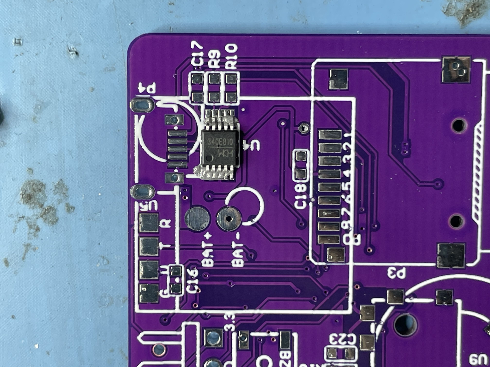

3. 风枪加热，主要风枪风度调节在**310度**左右，均匀吹芯片的引脚，直到锡膏融化，变得有金属光泽，液态锡会因为表面张力自动“爬上”焊盘与芯片引脚。  
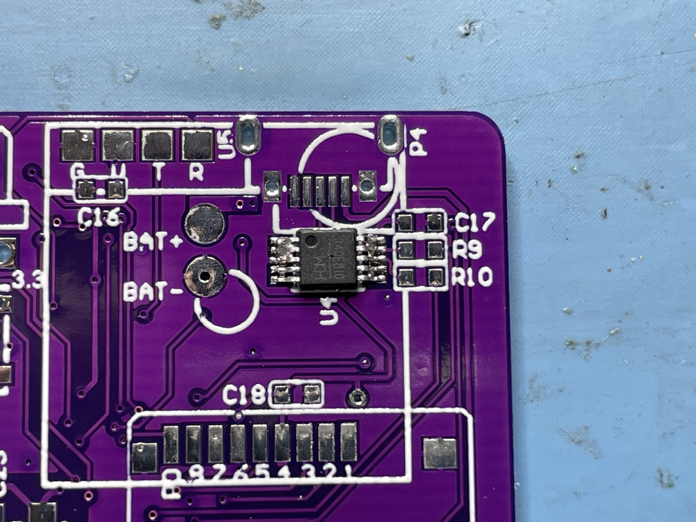

4. 如果你不小心放了过多的锡膏，会导致引脚短路，这时用刀头烙铁配合助焊剂，“刮”掉多余的锡，芯片周围的物质就是助焊剂的残留，最后可以用牙刷沾酒精刷掉。  
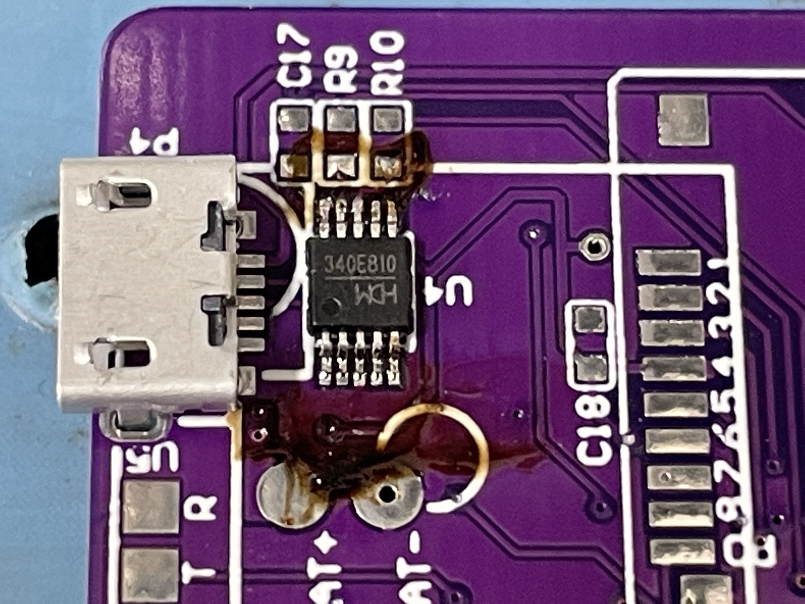

5. 同理焊接USB接口  
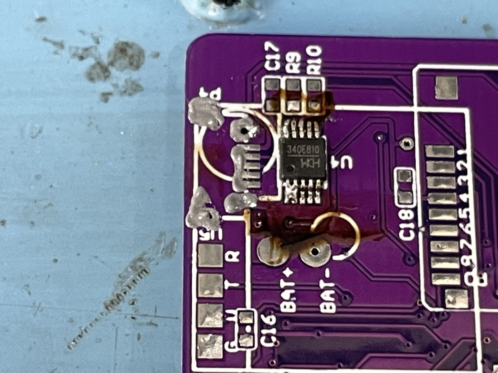  
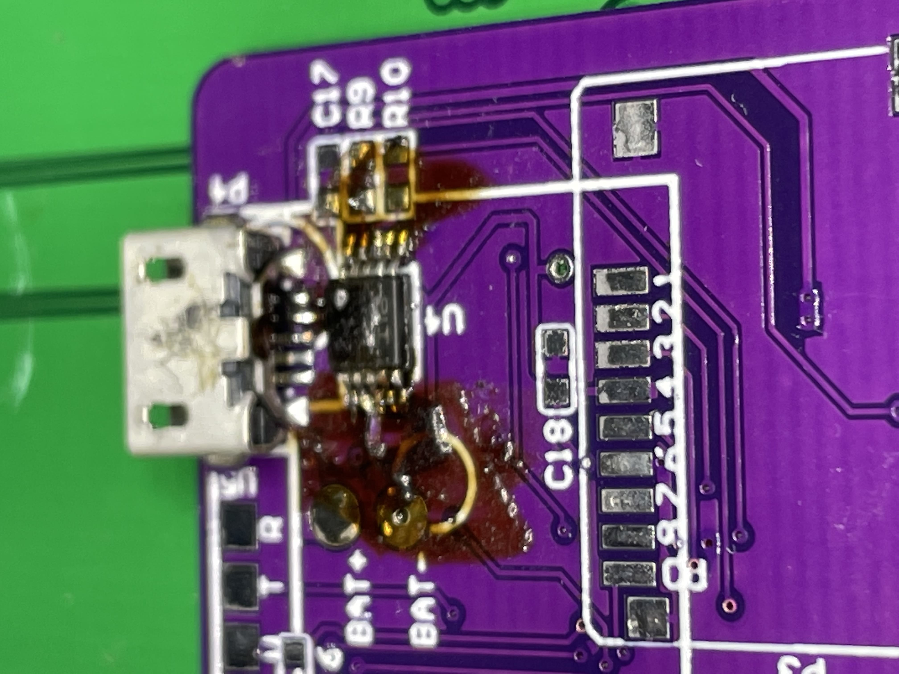

6. 清理助焊剂，用牙刷沾酒精（无水乙醇，如果是医用75%酒精效果不是很好，可能要多刷一会）刷一下，很容易就刷掉了  
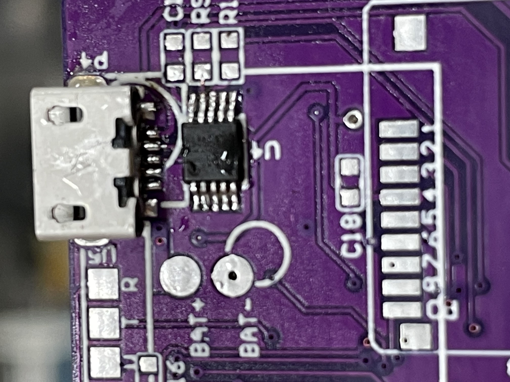

7. 把R9 R10 焊接上

#### 3.1.2 测试

根据原理图，发现CH340是由3V3供电，而不是USB，目前我们没有焊接稳压芯片，所以这里我们需要用调试器上的3.3V为芯片供电。  

我们使用杜邦线连接调试接口的3.3引脚（这里用手轻轻压住，因为是调试所以就不焊接了），并且用USB线连接电脑和板子，查看设备管理器是否出现了CH340 端口设备  
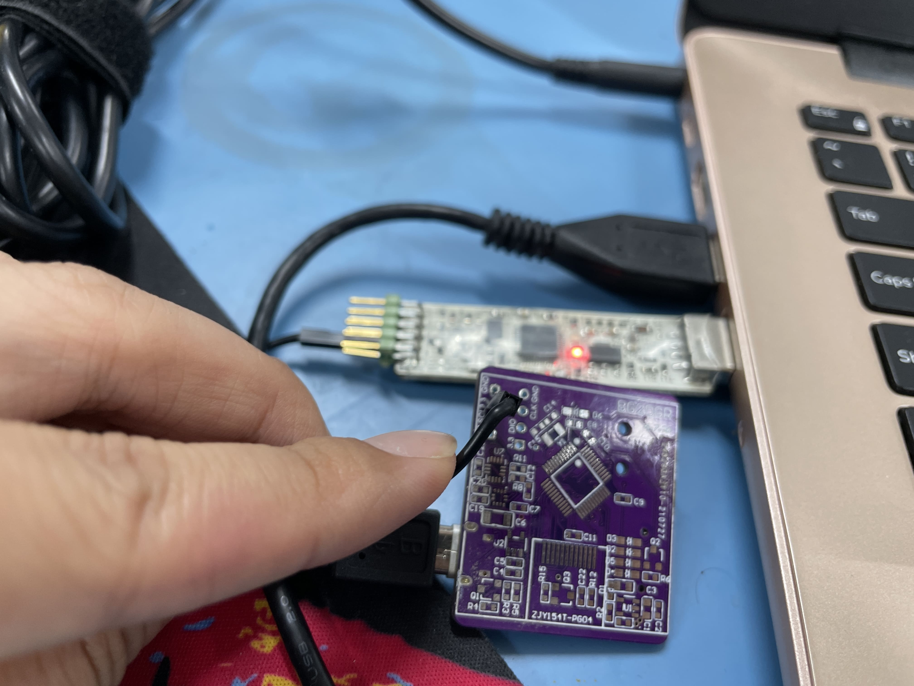  
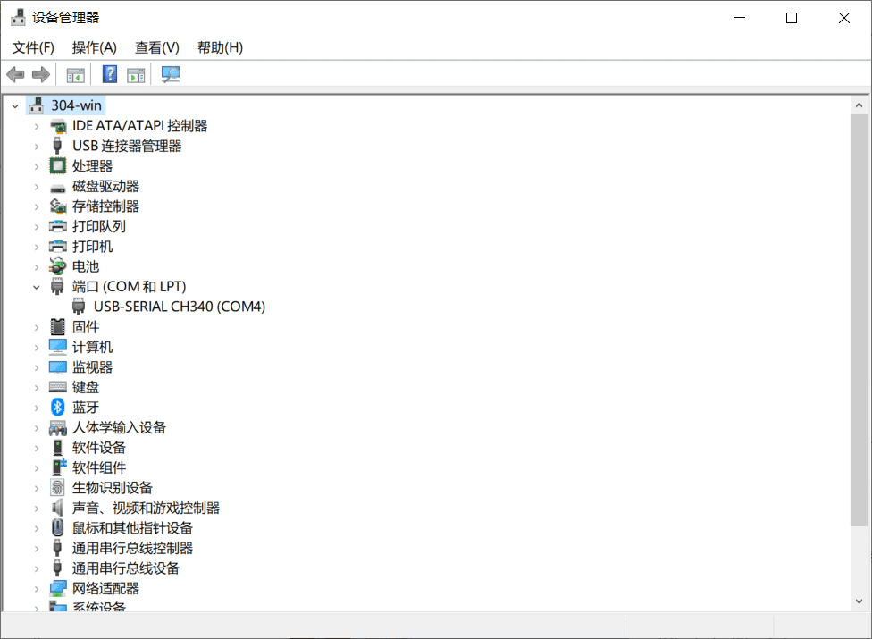

**注意** 我USB线与STLink调试器连接了同一计算机的USB下，因此STLink到板子上没有接地线！如果你无法保证不同USB口是否共地，请额外连接一根GND线。

如果出现了USB未能识别该设备的提示，请检查USB接口的焊接是否把引脚短路！，如果CH340没有供电，是不会有任何提示的！请检查CH340的供电，并且检查USB D+ D-两个引脚到CH340的连通性，以及是否存在短路。

### <a name="chg"> 3.2 电源管理芯片

电源管理芯片用来管理对锂电池充电的，我们先焊接这个部分，然后就能测试电池充电是否正常了。原理图如下。  

#### 3.2.1 焊接

芯片的焊接方法

1. 向一个焊盘焊入少量的锡，保证覆盖整个焊盘  
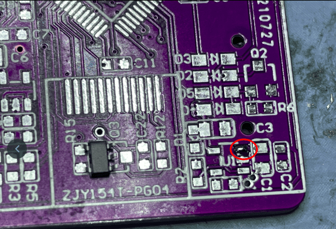

2. 加热上一步的焊盘，使焊锡融化，同时将芯片放入该焊盘，用镊子小心调整位置，使芯片与焊盘对齐  
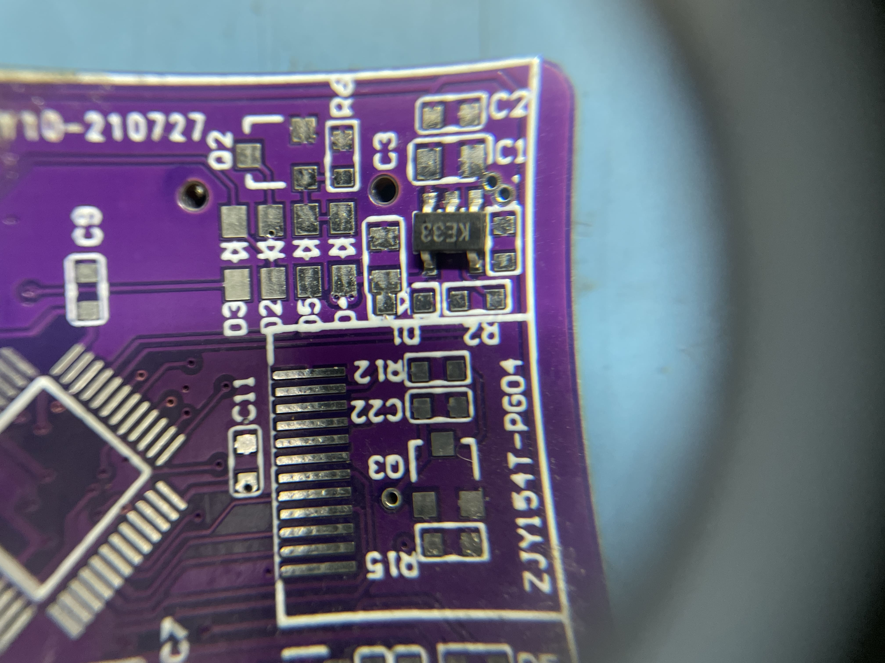

3. 将其他引脚都焊入焊锡  
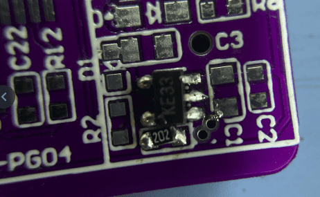

4. 焊接周围的元件  
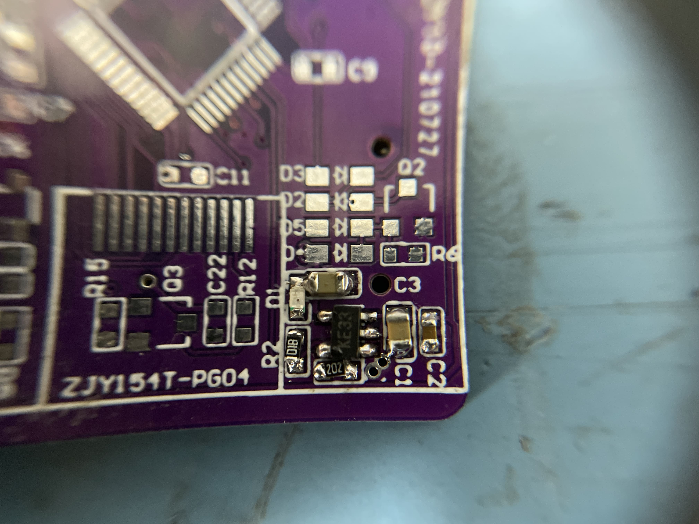

（新手不要吐嘈我焊接水平差）

#### 3.2.2 测试

1. 插入USB线，用万用表测量C1的上端（远离PCB边缘一侧），查看电压是否为4.1V左右  

2. 接入锂电池，观察充电指示灯是否亮起  
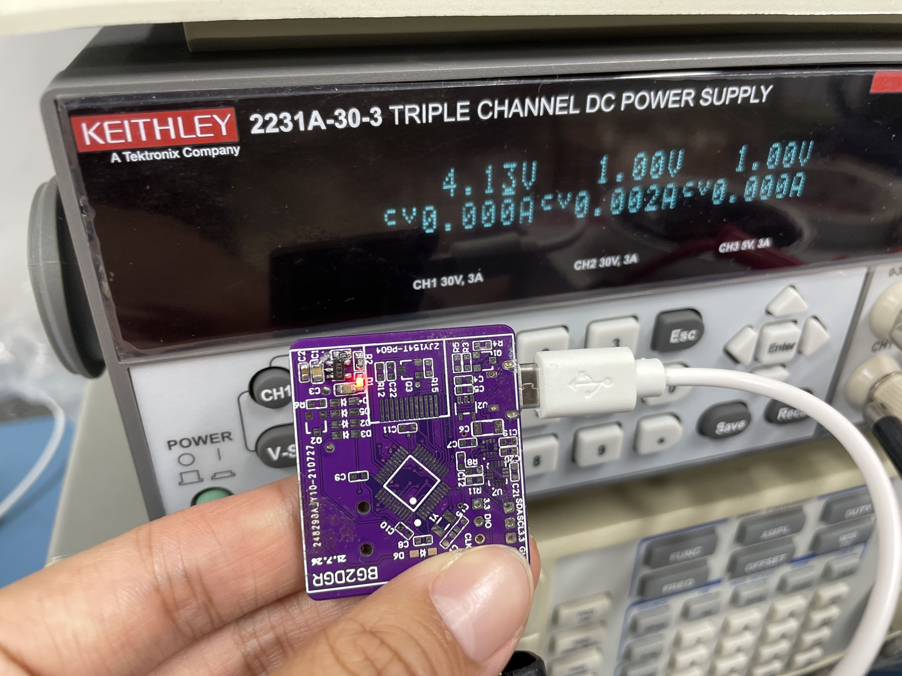  
说明：如果有可调电源的小伙伴，可以把可调电源设置为3.7V，接入PCB背面的BAT+ BAT-，插入USB即可。（我这么做是因为没有多余的电池了）

3. **为了后续焊接的安全，拆掉锂电池**

### <a name="lpo"> 3.3 稳压芯片 & 开关控制

LP5907-3.3V是稳压芯片，作用是把电池的电压稳定到3.3V，以供板上其他芯片使用。其他的mosfet+二极管的组合，是用来实现电源控制的。其中我们要验证这部分电路是否工作正常，只需要给PWR_EN一个高电平信号，就可以导通Q1 与 Q2，实现BAT_IN到BAT的供电，再看U2一旦BAT导通到BAT_IN，芯片就会将电池的电压转换为3.3V。

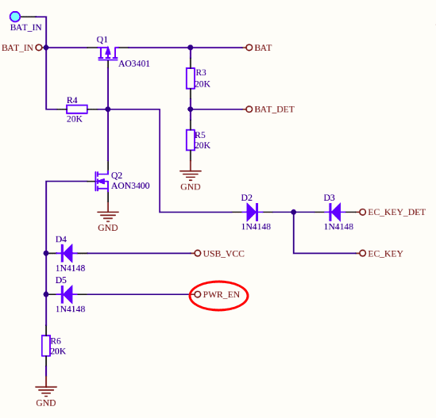

#### 3.3.1 焊接

这部分焊接的部分就不赘述了，下图中红色方框部分是稳压芯片，椭圆的二个红圈内为开关控制部分。  

#### 3.3.2 测试

1. 接入电池
2. 利用调试器的3.3V输出引脚给D5正极（左侧）一个高电平信号，下图中，左下角的黑色杜邦线接到STLink的3.3V引脚，左上角GND要与STLink共地  

3. 用万用表测量板子左上角调试接口的3.3V，观察输出是否为3.3V，断开D5正极的高电平信号，观察万用表测量结果是否归零  
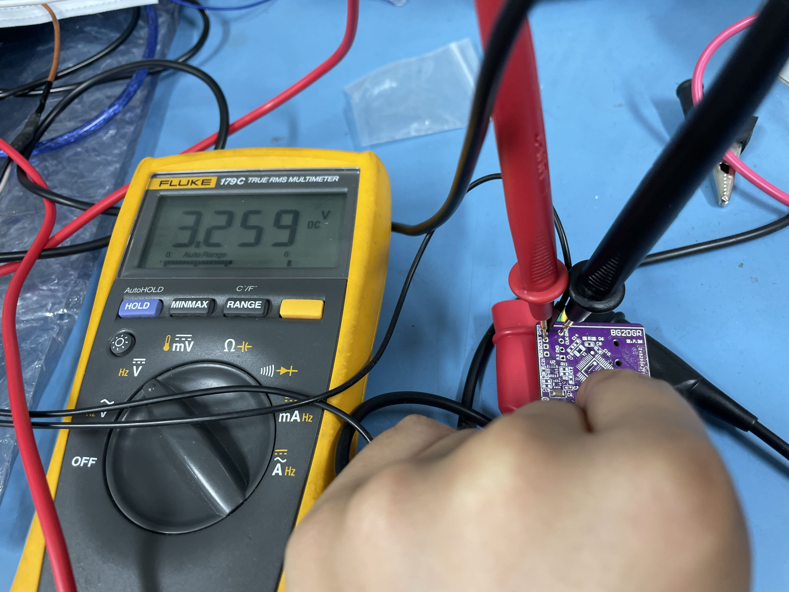

4. 为了后续焊接的安全，拆掉锂电池

### <a name="mcu"> 3.4 MCU拖焊

当然如果你有锡膏和风枪，可以按照ch340的焊接方法焊接。但是对于类似LQFP这类引脚露出，紧密排列的用刀头烙铁拖焊也是不错的选择。

#### 3.4.1 芯片拖焊方法
1. 首先个一个焊盘上合适的锡  
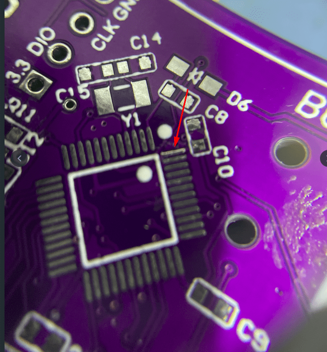

2. 用烙铁加热该焊盘，同时用镊子放置芯片，直到芯片与焊盘对齐，拿掉烙铁，为了防止一个焊盘固定不住，可以在另一个边再随意上点锡，如下图就有两个点固定。  
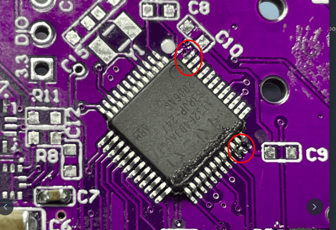

3. 用刀头烙铁的刀刃与芯片引脚相切，并用焊锡丝均匀涂抹芯片引脚上锡。

4. 通常上一步涂抹的时候你无法保证锡量的多少，会有个别引脚短路。这是需要用焊接海绵（焊接铜丝球）清除你的烙铁头，保证上面没有焊锡，并沾大量的助焊剂，用刀头刮芯片的引脚，使得短路的引脚上多余的锡被刀头刮掉。  
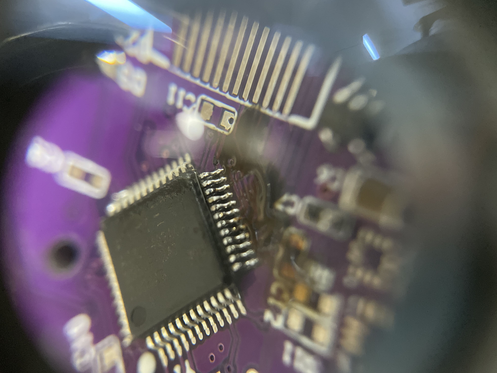

5. 重复3、4步，将剩下的3个边焊好，这时由于助焊剂的原因，你的板子和芯片会很恶心，用牙刷沾无水酒精刷掉即可。  

6. 焊接MCU周边的元件，主要是电源滤波电容C9~C12；RTC震荡电路Y1、C14、C15；复位电路K1、R7、C13；以及VBAT D6、C8。由于比较简单不再赘述。

#### 3.4.2 MCU测试

这里测试比较简单，用STLink（调试器）向MCU烧录程序即可。STLink的四个脚用杜邦线直接连接到板子的调试口，并用手轻轻按压就可充分接触，再在计算机上操作MDK下载程序。
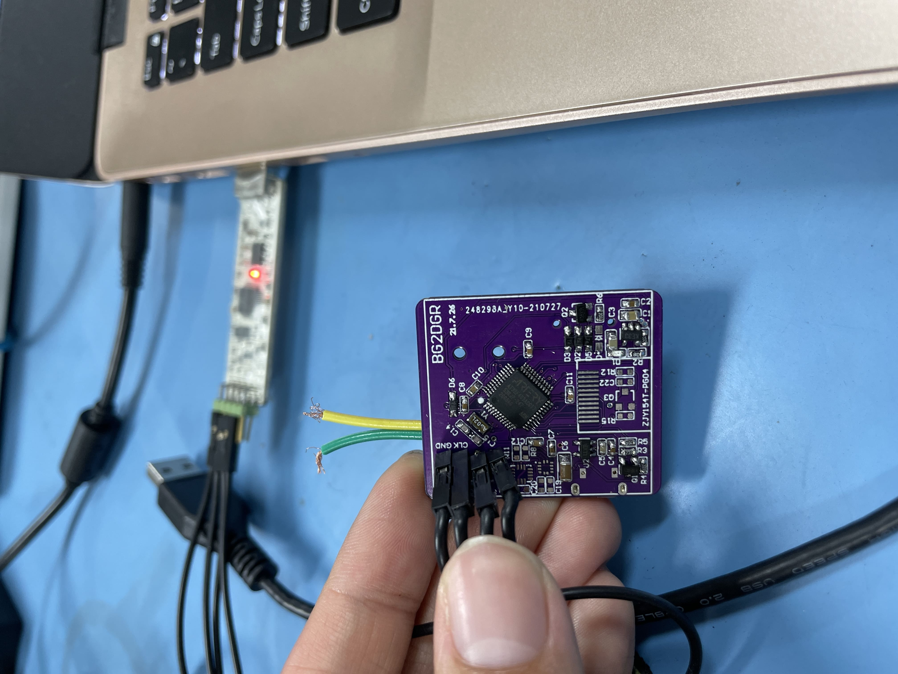
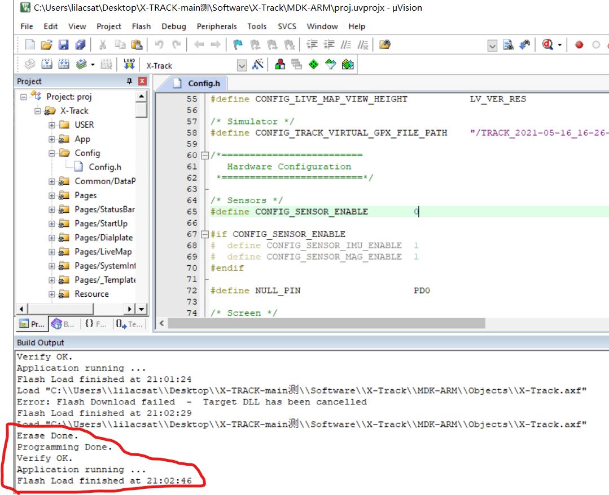

如果显示检测芯片失败，就要仔细检查芯片的焊接。

### <a name="encoder">  3.5 编码器 & 蜂鸣器

这里原理比较简单，也很容易焊接，注意这里的焊接顺序应该把编码器和蜂鸣器周边的元件先焊接好，最后再焊接蜂鸣器和编码器。

### <a name="sd"> 3.6 SD卡槽

这里要注意最好用尖头烙铁一点点焊，信号引脚不建议拖焊，因为引脚容易和金属外壳短路。  
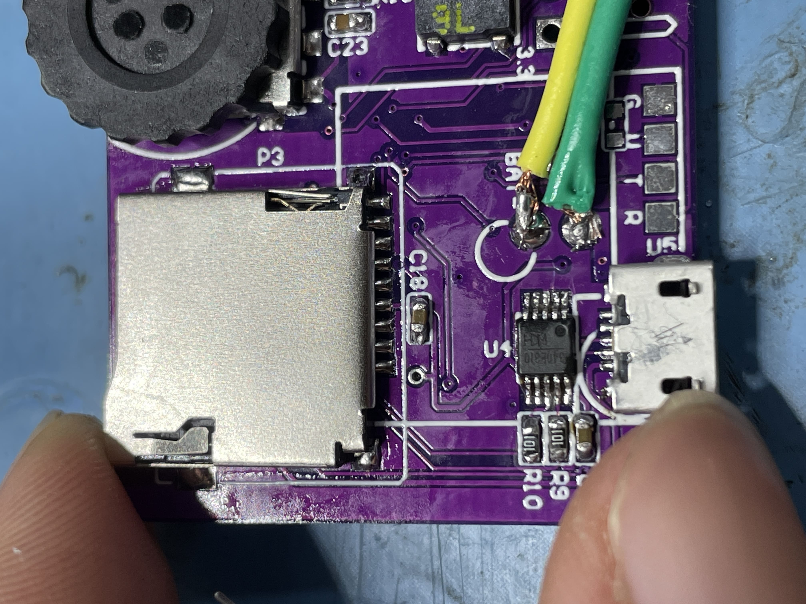

### <a name="lcd"> 3.7 屏幕

首先要焊接背光控制电路  
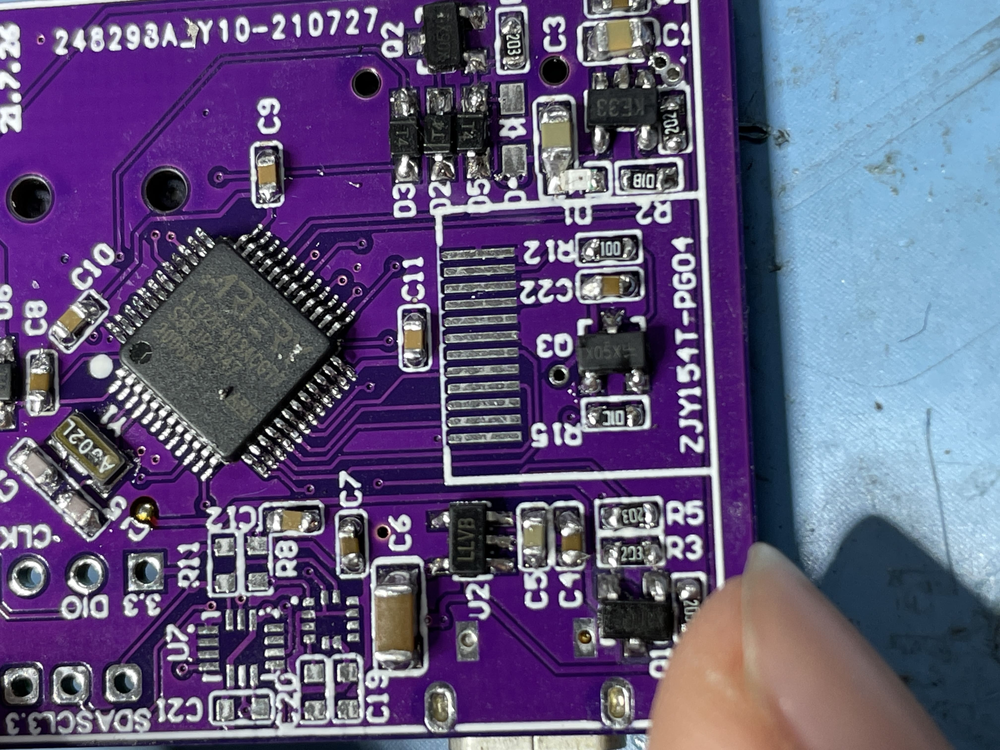  
焊接屏幕排线时，先把所有焊盘加上锡，然后用刀头固定住，最后用尖头烙铁一个一个引脚加锡，使得排线的正反两面均有焊锡，保证牢固。  
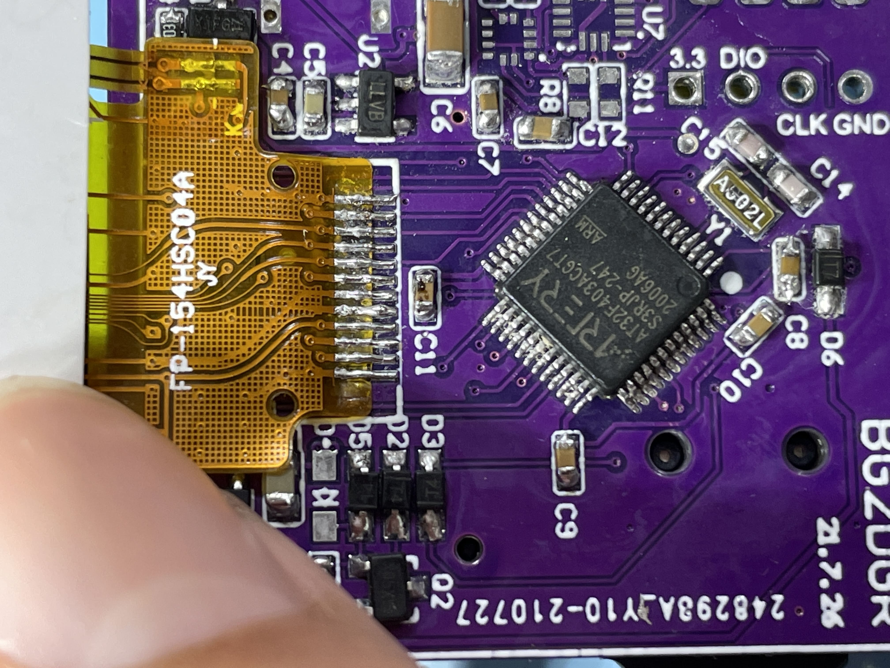  

### <a name="gps"> 3.8 GPS

最后焊接上GPS模块即可，模块上的字和PCB上的丝印一一对应（T-T R-R）

## <a name="debug"> 4. 整体测试

最终焊接上电池，就可以上电测试了，测试的效果就不放图了，跟主页上面的视频一样就说明功能都测试通过啦。

1. 长按按钮开机，开机后蜂鸣器会响。如果没有反应，首先通过万用表测试3.3V调试端口的电压，会不会在按下按钮时为3.3V，否则，检查编码器的焊接和电源开关部分的焊接情况。

2. 显示屏不亮，如果用手电筒从显示屏的背面照亮显示屏，如果有内容，说明背光电路有问题，检查背光电路，如果没有内容，检查屏幕焊接。

3. 屏幕空白或花屏，检查屏幕信号线及MCU的焊接情况。

4. 蜂鸣器不响，检查蜂鸣器电路和MCU焊接

5. 检测不到SD卡，检查SD格式是否正确，检查SD卡座焊接。
